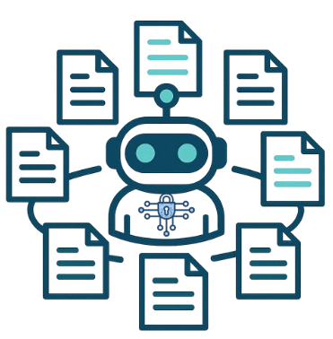

<div align="center">
  
  <h1 align="center">CTIConnect: A Benchmark for Retrieval-Augmented LLMs over Heterogeneous Cyber Threat Intelligence</h1>
</div>

<p align="center">
  <a href="https://arxiv.org/abs/xxxx.xxxxx"></a>
  <a href="#"></a>
  <a href="https://github.com/peng-gao-lab/CTIConnect/blob/main/LICENSE"></a>
</p>

## 🔔 Introduction

<p align="center">
   
</p>

**CTIConnect** is a benchmark for systematically evaluating retrieval-augmented LLMs across the Cyber Threat Intelligence (CTI) task landscape. It integrates five heterogeneous CTI sources (CVE, CWE, CAPEC, MITRE ATT&CK, and vendor threat reports) into **691 expert-curated QA pairs** spanning **nine tasks** across **three categories**:

| Category | Tasks | Source → Target | Retrieval Strategy |
|---|---|---|---|
| **Entity Linking** | RCM, WIM, ATD, ESD | Structured → Structured | Extract-then-Retrieve (EtR) |
| **Multi-Document Synthesis** | TAP, MLA, CSC | Unstructured → Unstructured | CSKG-Guided RAG |
| **Entity Attribution** | ATA, VCA | Unstructured → Structured | Decompose-then-Retrieve (DtR) |

All tasks are evaluated under three retrieval configurations: **Closed-Book**, **Vanilla RAG**, and **Domain-Specific** strategies, across ten state-of-the-art LLMs.

## 📁 Repository Structure

```
CTIConnect/
├── datasets/
│   ├── entity_linking/          # RCM, WIM, ATD, ESD
│   ├── multi_doc_synthesis/     # TAP, MLA, CSC
│   └── entity_attribution/      # ATA, VCA
├── baselines/
│   ├── entity_linking/          # EtR + Vanilla RAG + Closed-Book
│   ├── multi_doc_synthesis/     # CSKG-Guided + Vanilla RAG
│   └── entity_attribution/      # DtR + Vanilla RAG + Closed-Book
├── evaluation/
│   ├── regex_evaluator.py       # Entity Linking & Attribution
│   └── llm_judge.py             # Multi-Document Synthesis (GPT-4)
├── knowledge_bases/             # CVE, CWE, CAPEC, ATT&CK data
└── requirements.txt
```

## ⚙️ Installation

```bash
git clone https://github.com/peng-gao-lab/CTIConnect.git
cd CTIConnect

# Install dependencies
pip install -r requirements.txt

# Set up API keys
export OPENAI_API_KEY="your_openai_api_key"
export GOOGLE_API_KEY="your_google_api_key"
export ANTHROPIC_API_KEY="your_anthropic_api_key"
```

## 🔍 Inference

### Entity Linking (RCM, WIM, ATD, ESD)

```bash
# Closed-Book
python baselines/entity_linking/run.py \
    --task rcm \
    --retrieval closed_book \
    --model gpt5

# Vanilla RAG
python baselines/entity_linking/run.py \
    --task rcm \
    --retrieval vanilla_rag \
    --model gpt5

# Domain-Specific (Extract-then-Retrieve)
python baselines/entity_linking/run.py \
    --task rcm \
    --retrieval etr \
    --model gpt5
```

### Multi-Document Synthesis (TAP, MLA, CSC)

```bash
# Vanilla RAG
python baselines/multi_doc_synthesis/run.py \
    --task tap \
    --retrieval vanilla_rag \
    --model gpt5

# Domain-Specific (CSKG-Guided)
python baselines/multi_doc_synthesis/run.py \
    --task tap \
    --retrieval cskg_guided \
    --model gpt5
```

### Entity Attribution (ATA, VCA)

```bash
# Closed-Book
python baselines/entity_attribution/run.py \
    --task ata \
    --retrieval closed_book \
    --model gpt5

# Vanilla RAG
python baselines/entity_attribution/run.py \
    --task ata \
    --retrieval vanilla_rag \
    --model gpt5

# Domain-Specific (Decompose-then-Retrieve)
python baselines/entity_attribution/run.py \
    --task ata \
    --retrieval dtr \
    --model gpt5
```

## ⭐ Evaluation

```bash
# Entity Linking & Entity Attribution (regex-based)
python evaluation/regex_evaluator.py \
    --task rcm \
    --input_dir baselines/entity_linking/output/rcm/

# Multi-Document Synthesis (LLM-as-a-Judge)
python evaluation/llm_judge.py \
    --task tap \
    --input_dir baselines/multi_doc_synthesis/output/tap/
```

## 📊 Supported Models

| Family | Models |
|---|---|
| OpenAI | GPT-5, GPT-4o |
| Anthropic | Claude-Sonnet-4, Claude-3.5-Haiku |
| Google | Gemini-2.5-Pro, Gemini-2.5-Flash |
| Alibaba | Qwen-3-235B |
| Microsoft | Phi-4 |
| Meta | LLaMA-3-405B, LLaMA-3-8B |
